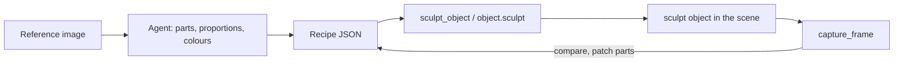

# Sculpt objects: a clay prop from one reference image

STATUS: in progress (#730)

An agent looks at a reference image, breaks the subject into a handful of soft clay parts, and stands the result in the set as one object. The object is **data, not code**: a `sculpt` record carries a recipe of parts, and CozyClay builds the geometry from it. Nothing the agent writes is executed.

This is the previs-sized version of the img2threejs loop. Two runs (a chibi turtle in glasses and a sea-stack diorama) showed where the time goes: 70% of it went to camera fitting and to working around a code generator. A recipe that the editor renders directly removes both.



## Why a recipe and not a baked GLB

| | Bake a GLB, then `import_mesh` | `sculpt` recipe |
|---|---|---|
| Memory-only MCP | No: needs a live editor | Yes |
| Project export | Bytes live in IndexedDB and are lost | Inside the scene JSON |
| Agent edits | Rebake the whole model | Patch one part |
| Safety | File parsing | Plain data, validated |

## Recipe contract (v1)

```json
{
  "version": 1,
  "parts": [
    { "id": "head", "shape": "blob", "size": [1.5, 0.84, 1.1], "roundness": 0.6,
      "position": [0, 1.55, 0.03], "rotation": [0, 20, -6], "color": "#4a8e9c" },
    { "id": "eye", "shape": "blob", "size": [0.44, 0.36, 0.3], "parent": "head",
      "position": [0.38, 0.1, 0.48], "color": "#ece8ec", "mirror": true },
    { "id": "rim", "shape": "frame", "size": [0.76, 0.42, 0.07], "border": 0.09, "parent": "head",
      "position": [0.41, 0.1, 0.68], "color": "#240405", "mirror": true }
  ]
}
```

Units are metres, angles are degrees, the floor is `y = 0`, front is `+z`, and the subject's own left is `+x`.

| Field | Meaning |
|---|---|
| `id` | Unique part name, `a-z 0-9 -`. |
| `shape` | `blob`, `box`, `cylinder`, `torus` or `frame`. |
| `size` | Full extents `[x, y, z]`. A torus reads `[outer diameter, outer diameter, tube diameter]`. |
| `roundness` | `blob`: 0 is an ellipsoid and 1 is a rounded box. `box`: the edge bevel as a fraction of the smallest side. |
| `taper` | `blob`, `cylinder`: −1 to 1. Positive values narrow the top and negative values narrow the bottom. A cylinder with taper 1 is a cone. |
| `border` | `frame`: the rim width in metres. A frame is a rectangular ring, like a glasses rim, a window or a picture frame. |
| `position`, `rotation` | Measured in the parent's frame when `parent` is set, otherwise in the object's frame. |
| `parent` | Another part's id. The part rides that part's position and rotation. |
| `mirror` | `true` adds a reflected copy across `x = 0` of the parent frame. This is a reflection and never a rotation. |
| `color` | `#rrggbb` clay colour. |

Limits: at most 48 parts after mirroring, each extent between 0.005 and 20 m, and parent chains at most 8 deep. A recipe that breaks a limit is refused with the reason. It is never clamped into a different shape.

The record stores the normalized recipe, plus `footprint` and `height` measured from the parts' bounds, so the plan board, the drop logic and the selection cage work without building geometry.

## Agent workflow (image → sculpt)

1. **Read the image before writing anything.** Name the subject, the parts and their contact relationships. List the 3–5 features that make the subject recognizable (for the turtle: oversized glasses, bulging eyes, the buck tooth, the belly plate). Say which sides the image hides.
2. **Block out in 4–8 parts.** Get the silhouette and the proportions right first. Measure in head units from the image and do not guess from a stock figure.
3. **Place it, then look.** Call `sculpt_object`, then `capture_frame` from roughly the reference's angle.
4. **Patch, don't rewrite.** Fix the biggest mismatch first: proportion, then placement, then colour. Allow three rounds at most, then report what still differs.
5. **Identity details last.** Add eyes, rims and plates as small parts on a parent once the body reads.

Ask, infer and omit follow `agent-prompt-to-scene.md`. Infer the hidden back and say so. Never ask for more views unless the user wants a likeness.

## Plan

| Step | Deliverable |
|---|---|
| 1 | `src/sculpt-recipe.js`: normalize, validate and measure bounds. Pure, with node tests. |
| 2 | `src/sculpt-geometry.js`: recipe to three.js Group (blob = superellipsoid radial remap). |
| 3 | `sculpt` kind: create, normalize, duplicate, serialize, render, hierarchy and inspector. |
| 4 | Studio action `object.sculpt` and MCP `sculpt_object`, in live and memory mode. |
| 5 | Agent rules (this page) in the MCP tool description and the Studio prompt. |
| 6 | QA: the turtle recipe through MCP into a live editor, with a screenshot in the PR. |

Out of scope, for follow-ups: saving a sculpt to the asset shelf, per-part editing gizmos, and textures.
